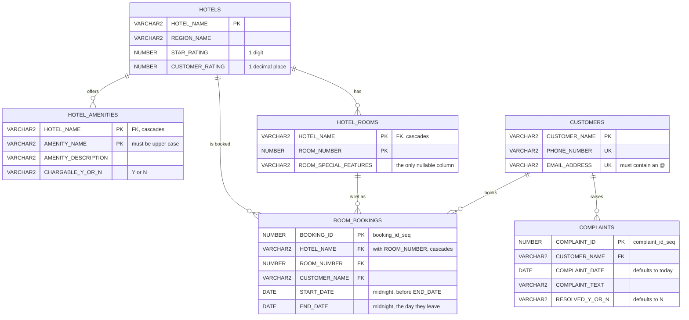

# mcpdbwizard-demo

A demo Oracle schema for [MCP DB Wizard](https://mcpdbwizard.com): a small hotel
booking database with enough tables, views, constraints and PL/SQL to exercise a
generator that turns Oracle metadata into an MCP server.

The wizard reads a schema, you tick the objects you are willing to expose, and it
generates an MCP server that has tools for those objects and nothing else. Objects
you did not tick are absent from the generated binary rather than blocked at
request time - [the config is the security model](https://mcpdbwizard.com/docs/configs/).
This repository is the other half of that exercise: the schema to point it at, plus
a saved config that already makes the interesting choices.

## Contents

| File | Purpose |
| --- | --- |
| `db/mcp_db_demo_ddl.sql` | Tables, indexes, views, sequences, `UPSERT_CUSTOMER`, `HOTEL_OCCUPANCY` and the `ROOM_MANAGER` package |
| `db/mcp_db_demo_dml.sql` | Sample data: 10 hotels, 21 amenities, 52 rooms, 43 customers, 92 bookings, 7 complaints |
| `db/mcp_db_demo_drop.sql` | Drops everything the DDL creates |
| `SqlStatements/*.sql` | Hand-written queries exposed as tools, one file per tool |
| `mcpdemo.json` | A saved wizard config: which objects to expose, and how |

## Installing

Against an empty schema:

```sql
@db/mcp_db_demo_ddl.sql
@db/mcp_db_demo_dml.sql
```

There are no migrations. This is demo data, so if you already have an older copy
of the schema, drop it and build it again rather than trying to alter it into
shape:

```sql
@db/mcp_db_demo_drop.sql
@db/mcp_db_demo_ddl.sql
@db/mcp_db_demo_dml.sql
```

The drop script drops every object the DDL creates, in an order the foreign keys
allow. On a schema that is already empty it will report that the objects do not
exist, which is safe to ignore.

## Running the wizard against it

The [quickstart](https://mcpdbwizard.com/docs/quickstart/) has the full version.
Pointed at this schema, the container looks roughly like this:

```bash
docker run -d --name mcpdbwizard \
  -p 8080:8080 \
  -v mcpdbwizard-demo:/data \
  -e MCPDBWIZARD_ORACLE_HOST=your.db.host \
  -e MCPDBWIZARD_ORACLE_PORT=1521 \
  -e MCPDBWIZARD_ORACLE_SID=/FREEPDB1 \
  -e MCPDBWIZARD_ORACLE_USER=MCP_DEMO \
  -e MCPDBWIZARD_ORACLE_OTHER_USER=SYNUSER \
  -e DB_PASS_FILE=/run/secrets/oracle \
  mcpdbwizard-web
```

The leading `/` on the SID is what makes it a service name rather than a SID.
Then open `http://localhost:8080`, upload `mcpdemo.json` on the Configs tab, and
put the four files from `SqlStatements/` where the config expects them - it looks
in `/data/sqltext/mcpdemo`, which is inside the `/data` volume mounted above.

Generate and run from the Runtime page. The generated server starts on the next
free loopback port in 8090-8109, but clients connect through the proxy on 8080,
not to that port directly:

```json
{
  "mcpServers": {
    "mcpdemo": {
      "url": "http://localhost:8080/mcp/mcpdemo",
      "headers": { "Authorization": "Bearer <id>.<secret>" }
    }
  }
}
```

The token comes from the Users page and is shown once. Note that this config has
`mcpHttpToken`, `mcpHttps` and `mcpOAuth` all set to `NO`, which is fine for a
demo on your own machine and not fine anywhere else.

## The schema

| Table | Holds |
| --- | --- |
| `HOTELS` | One row per hotel, with a region, a star rating and a customer rating |
| `HOTEL_AMENITIES` | What each hotel offers, and whether it is chargeable |
| `HOTEL_ROOMS` | Room numbers, with optional notes on what makes a room unusual |
| `CUSTOMERS` | Customer name, phone number and email address |
| `ROOM_BOOKINGS` | Who is in which room, between which dates |
| `COMPLAINTS` | What a customer complained about, when, and whether it was resolved |



Every join is a real constraint. `ROOM_BOOKINGS` reaches `HOTEL_ROOMS` on both
columns at once, and separately carries its own foreign key to `HOTELS`.

`HOTEL_ROOMS_FK1`, `HOTEL_AMENITIES_FK1` and `ROOM_BOOKINGS_HOTEL_ROOM` all
cascade on delete, so removing a hotel is meant to take its rooms and amenities
with it, and the rooms their bookings. Note that `ROOM_BOOKINGS` also holds a
second, non-cascading foreign key to `HOTELS`, so deleting a hotel that still has
bookings may raise `ORA-02292` rather than cascading cleanly. Delete the bookings
first if you want to be sure.

Nothing cascades from `CUSTOMERS`, so a customer with a booking or a complaint on
file cannot be deleted until those go first.

Two views summarise the reference data: `HOTEL_REGIONS` aggregates ratings by
region, and `HOTEL_AMENITIES_SUMMARY` gives the percentage of hotels that charge
for each amenity.

`BOOKING_ID_SEQ` supplies booking ids, quoted explicitly by the sample
bookings. `COMPLAINT_ID_SEQ` is wired up as the default for
`COMPLAINTS.COMPLAINT_ID`, so an insert can leave the id out and let the
database allocate it:

```sql
INSERT INTO complaints (customer_name, complaint_text)
VALUES ('MR FOX','My room is constructed from crushed sake bottles');
```

`COMPLAINT_DATE` defaults to today and `RESOLVED_Y_OR_N` to `N`, so a new
complaint needs only the customer and the text.

The sample bookings deliberately include hotels that are sold out for parts of
the range, so occupancy and availability have something to report other than
"yes, there is a room".

### CUSTOMERS

All three columns are mandatory, and each carries a rule worth knowing about
before you write to the table:

- `CUSTOMER_NAME` is the primary key
- `EMAIL_ADDRESS` and `PHONE_NUMBER` are each unique, so no two customers can
  share either
- `CUSTOMERS_EMAIL_HAS_AT` requires the email address to contain an `@` with at
  least one character on both sides

Uniqueness is enforced on the stored value, so case matters: write through
`UPSERT_CUSTOMER` and it is handled for you.

### ROOM_BOOKINGS

`START_BEFORE_END` requires the start to be strictly before the end, and both
dates must be midnight exactly. Read `END_DATE` as the day the guest leaves.

## ROOM_MANAGER

A package with the two halves of booking a room: find out what is free, then
take some of it.

```sql
PROCEDURE getRoomList
   ( p_hotel_name IN  VARCHAR2
   , p_from_date  IN  DATE
   , p_to_date    IN  DATE
   , p_results    OUT RoomCursor
   , p_message    OUT VARCHAR2 )
```

Rooms in the named hotel with nothing booked over the range, as a ref cursor of
`HOTEL_ROOMS` rows. The hotel name is upper-cased and trimmed. A missing hotel
name or either date comes back through `p_message` with the cursor left unopened.

```sql
PROCEDURE BookRoom
   ( p_hotel_name    IN  VARCHAR2
   , p_customer_name IN  VARCHAR2
   , p_from_date     IN  DATE
   , p_to_date       IN  DATE
   , p_room_count    IN  NATURAL
   , BookingCursor   OUT BookingCursor
   , p_message       OUT VARCHAR2 )
```

Books `p_room_count` of whatever `getRoomList` found. It is all or nothing: if
fewer rooms are free than were asked for, nothing is booked and `p_message` says
so. The cursor comes back either way, because the same customer may hold more
than one booking for those dates - `p_message` is what tells you which happened.

## HOTEL_OCCUPANCY

Occupancy by hotel by day, as a percentage of the hotel's rooms. The date range
is required. The hotel name is not optional either, but it accepts null, and
null means every hotel.

```sql
PROCEDURE HOTEL_OCCUPANCY
   ( p_from_date  IN  DATE
   , p_to_date    IN  DATE
   , p_results    OUT SYS_REFCURSOR
   , p_hotel_name IN  VARCHAR2 )
```

```sql
DECLARE
   v_results SYS_REFCURSOR;
BEGIN
   hotel_occupancy(DATE '2026-05-04', DATE '2026-05-11', v_results, NULL);              -- every hotel
   hotel_occupancy(DATE '2026-05-04', DATE '2026-05-11', v_results, 'grand budapest');  -- just the one
END;
/
```

Each row is a hotel on a day: `OCCUPANCY_DATE`, `HOTEL_NAME`, `ROOMS_IN_HOTEL`,
`ROOMS_OCCUPIED` and `PERCENT_OCCUPIED`. Days with no bookings come back as 0%
rather than being left out, so the result is a complete series. The hotel name
is upper-cased and trimmed for you.

Bad input raises rather than returning an empty result, so a caller can tell the
difference between "nobody stayed" and "you asked the wrong question":

| Problem | Error |
| --- | --- |
| No from date | `ORA-20001: A from date is required` |
| No to date | `ORA-20002: A to date is required` |
| Range the wrong way round | `ORA-20003: The from date must not be after the to date` |
| Hotel does not exist | `ORA-20004: There is no hotel called X` |

## UPSERT_CUSTOMER

Takes a whole customer row and reports what it did. A PL/SQL procedure cannot
return a value, so the message comes back through an `OUT` parameter:

```sql
PROCEDURE UPSERT_CUSTOMER
   ( p_customer IN  CUSTOMERS%ROWTYPE
   , p_message  OUT VARCHAR2 )
```

It normalises before it writes - the customer name is upper-cased, the email
address lower-cased, and both the email and phone are trimmed - so the same
customer submitted in a different case is recognised as the same customer
rather than rejected as a duplicate email.

| Situation | Message |
| --- | --- |
| Name not on file | `Created customer X` |
| On file, contact details differ | `Updated customer X` |
| On file, nothing has changed | `This customer already exists` |
| Email address belongs to someone else | `Email address a@b.zz already belongs to another customer` |
| Phone number belongs to someone else | `Phone number +1 555 0100 already belongs to another customer` |
| Email address has no usable `@` | `Email address a.b.zz is not a valid email address, it needs an @ with text on both sides` |
| A mandatory column is missing | `A customer name is required`, `A phone number is required` or `An email address is required` |
| Another session is mid-change on this customer | `Customer X is being changed by someone else, please try again` |

Every outcome is a sentence, including the ones a constraint would otherwise
report as `ORA-00001` or `ORA-02290`, so a caller has something to show a user.

The procedure commits its own work: an insert or an update is committed before
the message comes back, so the caller does not have to, and cannot roll it back
afterwards.

```sql
DECLARE
   v_cust CUSTOMERS%ROWTYPE;
   v_msg  VARCHAR2(200);
BEGIN
   v_cust.customer_name  := 'dignan';
   v_cust.phone_number   := '+1 214 555 0190';
   v_cust.email_address  := 'Dignan@BottleRocket.zz';
   upsert_customer(v_cust, v_msg);
   dbms_output.put_line(v_msg);   -- Created customer DIGNAN, already committed
END;
/
```

## SQL statements

Queries that are not worth a procedure but are worth a tool. One file becomes one
tool, so [declining to select a statement is the control](https://mcpdbwizard.com/docs/sql-statements/).

| File | Returns |
| --- | --- |
| `amenity_list.sql` | Every amenity, and how often it is charged for |
| `region_list.sql` | Ratings aggregated by region |
| `complaints_per_customer.sql` | One customer's complaints, oldest first |
| `stays_per_customer.sql` | One customer's bookings, oldest first |

Bind variables are typed in a trailing comment, which is how a `?` gets a type
on the way out to JSON:

```sql
SELECT booking_id, hotel_name, room_number, start_date, end_date
from room_bookings
where customer_name = UPPER(LTRIM(RTRIM(? /* String */)))
ORDER BY start_date, booking_id;
```

Wrapping the bind in `UPPER(LTRIM(RTRIM(...)))` means a caller can pass a name in
any case and still match what is stored.

## The config

`mcpdemo.json` is a saved config, in the format the Configs tab downloads. It
selects:

- **8 tables and views**, every one of them `"mcpCrud": "R"`. Read only: create,
  update and delete are per-table ticks and none of them are ticked here
- **2 sequences**, `BOOKING_ID_SEQ` and `COMPLAINT_ID_SEQ`
- **4 procedures**: `ROOM_MANAGER.GETROOMLIST`, `ROOM_MANAGER.BOOKROOM`,
  `HOTEL_OCCUPANCY` and `UPSERT_CUSTOMER`
- **4 SQL statements**, the files in `SqlStatements/`

So the only ways to change anything are the procedures, which is the point: the
writes that exist are the ones that enforce their own rules.

Two of the procedures carry an `mcpDescription`, which is what the agent reads
when it is deciding whether this is the tool it wants:

```json
{ "name": "GETROOMLIST", "pkg": "ROOM_MANAGER",
  "mcpDescription": "use this to  check availability for a specific hotel for a specific date range" }
```

The config never stores a password. `pass` and the connection string both carry
the literal `FROM_ENV_VARIABLE_DB_PASS`, and the real password arrives in the
container's environment.
